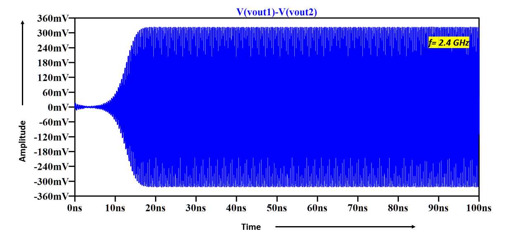
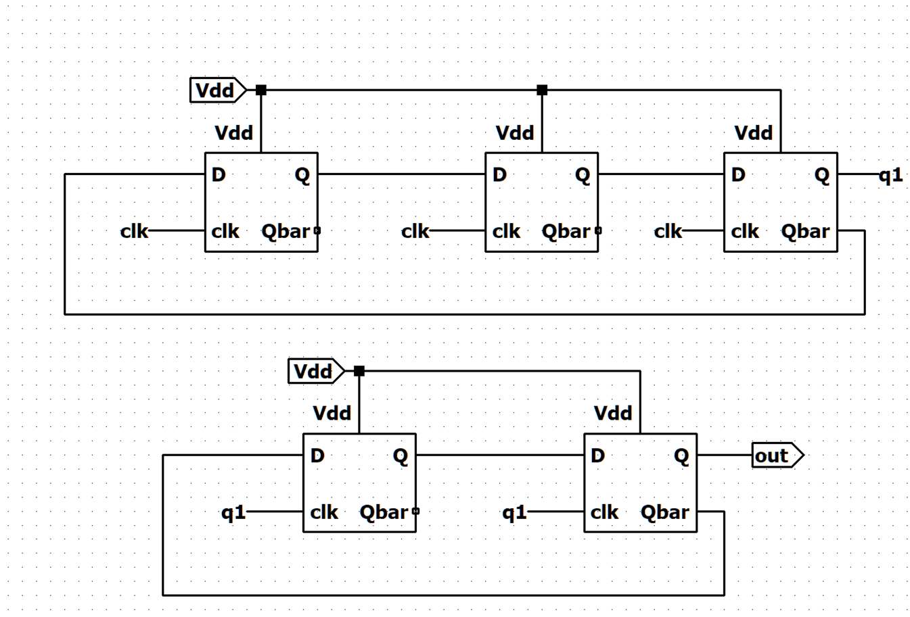
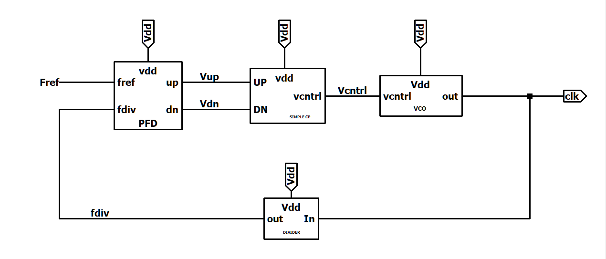

# 📡 Design of Phase-Locked Loop (PLL) for 2.4 GHz Frequency in 180nm CMOS Technology

A comprehensive transistor-level design and simulation of a low-power **Phase-Locked Loop (PLL)** operating at **2.4 GHz**, implemented using **180nm CMOS technology** and verified via **LTspice**. The project aims at building a frequency synthesizer suitable for **ISM band** applications such as **Wi-Fi**, **Bluetooth**, and **ZigBee** transceivers.

---

## 📘 Abstract

This project details the design and simulation of a fully integrated **Phase-Locked Loop (PLL)** that synthesizes a 2.4 GHz output from a 100 MHz reference using a divide-by-24 feedback loop. All sub-circuits including the **LC-based VCO**, **Phase Frequency Detector (PFD)**, **Charge Pump**, **Loop Filter**, and **Frequency Divider** are implemented at the transistor level using the 180nm technology node. The PLL is optimized for **low power consumption (6.36 mW)** and demonstrates stable locking characteristics with a control voltage of ~0.5 V.

---

## 🔧 Technologies Used

- CMOS 180nm Process Technology  
- LTspice for transistor-level simulation  
---

## 📐 PLL Architecture Overview

The PLL is composed of the following blocks:

1. **Phase Frequency Detector (PFD)**: Detects phase and frequency differences between reference and feedback signals using edge-triggered logic.  
2. **Charge Pump (CP)**: Converts digital UP/DN pulses from the PFD into current pulses.  
3. **Loop Filter (LF)**: Smooths the current from CP into a control voltage (Vctrl) using a 2nd order passive RC filter.  
4. **Voltage-Controlled Oscillator (VCO)**: LC-based VCO using cross-coupled NMOS for negative resistance and MOS varactors for tuning.  
5. **Frequency Divider**: MOD-24 divider using cascaded MOD-6 and MOD-4 Johnson counters built with TSPC flip-flops.

---

## 📈 Performance Metrics

| Parameter                  | Value         |
|---------------------------|---------------|
| Technology Node           | 180nm CMOS    |
| Supply Voltage (VDD)      | 1.5 V         |
| Reference Frequency       | 100 MHz       |
| Output Frequency          | 2.4 GHz       |
| Divider Ratio             | 24            |
| Locking Time              | ~12 µs        |
| Control Voltage (Vctrl)   | ~0.5 V        |
| VCO Gain (Kvco)           | 177 MHz/V     |
| Control Voltage Ripple    | ~20 mV        |
| Power Dissipation         | 6.36 mW       |

---

## 🧪 Simulation Snapshots

> Place the following images inside the `/assets` folder and use these names to ensure correct rendering.

### 🔸 PLL Block Diagram  

### 🔸 VCO Differential Output at 2.4 GHz  

### 🔸 Kvco vs. Control Voltage  

### 🔸 Divider Output  

### 🔸 Locking Behavior of PLL  

---

## 🧠 Design Highlights

### ✅ LC VCO
- LC Tank: 1 nH inductor and ~4.3 pF MOS varactor
- Cross-coupled NMOS pair for negative resistance generation
- Center frequency at 2.4 GHz with Kvco = 177 MHz/V

### ✅ Frequency Divider
- MOD-6 × MOD-4 Johnson counter configuration = MOD-24
- Built using TSPC logic-based D flip-flops for high-speed operation
- Final output: 100 MHz digital signal from 2.4 GHz input

### ✅ PFD & Charge Pump
- NAND-based topology for detecting both phase and frequency differences
- 100 µA charge pump current
- 2nd-order passive loop filter:  
  - Rs = 15 kΩ  
  - Cs = 18 pF  
  - Cp = 1 pF  
  - Bandwidth ≈ 1.76 MHz

---

## 🔭 Future Work

- **Post-layout simulation** with parasitic extraction in Cadence  
- **Jitter optimization** through better CP matching and noise filtering  
- **Clock injection techniques** to enhance locking speed  
- **Power minimization** via bias optimization and advanced CMOS scaling  

---

## 👨‍🎓 Contributors

| Name                        | Roll No.    |
|-----------------------------|-------------|
| Afzal Malik                | 21ELB173    |
| Mohammed Musayyeb Sherwani | 21ELB283    |

**Supervisor:** Prof. Naushad Alam  
Department of Electronics Engineering  
Zakir Husain College of Engineering & Technology  
**Aligarh Muslim University**

---

## 📚 References

1. B. Razavi, *Design of Analog CMOS Integrated Circuits*, McGraw-Hill  
2. Hokrani et al., “PLL Design in 180nm Technology,” IEEE I2CT, 2018  
3. Hamel & Norris, “LC Tank VCO Tutorial,” University of Waterloo  
4. IEEE RFIT 2021: “2.4 GHz Wide-tuning VCO using Switchable IMOS Varactor”  

---

## 📜 License

© 2025 Aligarh Muslim University — All rights reserved.

---

